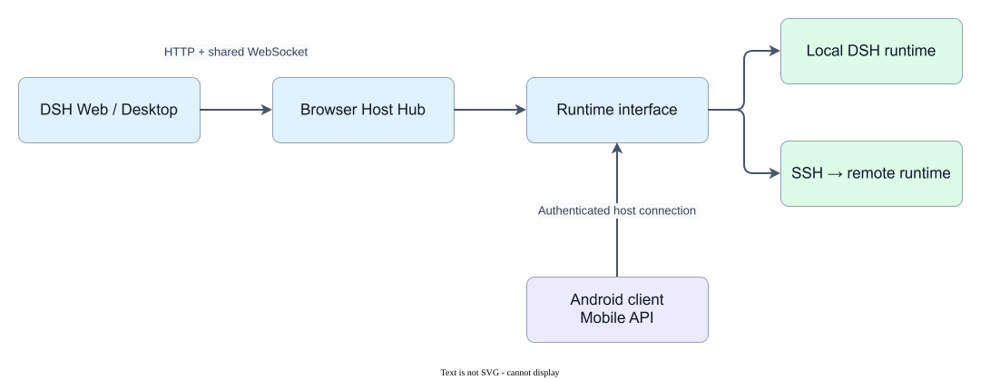
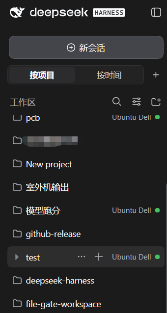
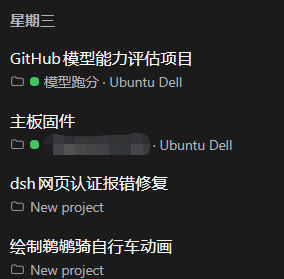

# DSH Remote Hosts

**DeepSeek Harness remote plugin · multi-host Web/Desktop · Android compatibility**

[简体中文](README.zh.md) · [Installation](INSTALL-PLAN.md) · [Compatibility](COMPATIBILITY.md) · [Releases](https://github.com/catcatchcatast/dsh-remote-hosts/releases) · [Android client](https://github.com/catcatchcatast/dsh-t-remote-android)

Operate local and remote DeepSeek Harness (DSH) projects through the familiar Web or Desktop interface. DSH Remote Hosts provides host-aware routing, shared browser streams, and mobile APIs as external plugins; it does not modify `dsh-core`.

This is a community project, not an official DeepSeek product. It connects to DSH runtimes already installed on your computers; it does not provide model subscriptions or credentials.

## Version status — read before installing

| What you are using | DSH target | Status |
| --- | --- | --- |
| Current source snapshot | `0.1.5-rc.2` | Preview; matching binaries in `v0.1.5-rc.2-preview` |
| Existing `v0.1.2-preview` downloads | `0.1.2-rc.1` | Older prerelease binaries; not rc.2 packages |
| Retained compatibility paths | `0.1.2-rc.1` | Included in source; validate the exact package/profile combination |
| Other versions, including stable 0.1.5 | — | Not claimed compatible |

**Do not install the old `v0.1.2-preview` downloads as a `0.1.5-rc.2` update.** Package directory names ending in `-rc1` are historical names; the current package closure and runtime target are defined by [`release-profile.json`](release-profile.json).

## What it helps you do

- Keep projects on the computer where they belong, while browsing local and remote work in one interface.
- Choose a target host in the project directory flow, browse its folders, and create a directory without losing the current selection flow.
- Open a conversation, follow its output, intervene in a running task, and handle approvals or questions across clients.
- Connect the companion native Android client without subscribing separately to the full history of every idle session.



*Conceptual connection diagram, not a product screenshot. Labels are generic and contain no account, device, host address, or conversation data.*

## Interface screenshots

Actual Web/Desktop screenshots showing project and session host ownership after Remote Hosts integration.

| Browse by project | Browse sessions by time |
| --- | --- |
|  |  |

Remote projects and sessions show their host label to make the target computer clear. Generic host labels are retained; selected project names remain obscured as in the original images. The displayed hosts are not preconfigured by the installation.

## Why this approach

| Design choice | Practical benefit |
| --- | --- |
| External compatibility packages | Version-specific adaptation stays outside the official core and can be rolled back with the profile. |
| One host-aware resource path | Local and remote session, workspace, file, and terminal operations keep explicit ownership. |
| One multiplexed browser WebSocket | Supported subscriptions share a connection instead of consuming one HTTP long connection each; ordinary requests remain HTTP. |
| One mobile global event listener per host | New events remain visible without eagerly following every cold conversation. |
| Bounded history reads | User-open reads and confirmed cursor gaps trigger recovery; heavy history work is limited to two host-wide jobs. |
| Tool summaries first | Mobile traffic omits complete tool parameters, output, and diffs until the user requests the detail page. |

These are implementation choices, not a promise of a fixed latency or permanent fault-free operation.

## Feature list

The following capabilities are implemented in the source preview. Availability also depends on the matching DSH runtime, profile, and host capabilities.

| Area | Capabilities |
| --- | --- |
| Projects and hosts | Aggregate local/remote workspaces, retain host labels and ownership, select a host for directory browsing, create folders, and route workspace creation to that host. |
| Sessions | Create, open, rename, branch, archive, queue input, steer, cancel, and reconnect through the host-aware path. |
| Workspace navigation | Consistent session menus; projects ordered by their most recently updated non-archived session, with newer sessions first within a project. |
| Live output | Workspace/session subscriptions and global events over the shared browser stream; mobile assistant-stream and sub-agent event adaptation. |
| Approvals and questions | Required decision context, approve/deny, cross-client resolution, stepwise questions, skip, and free-text responses. |
| Models and subscriptions | Runtime model catalog/selection adaptation, configurable catalog filtering, and compatibility routing for subscription plugins. Accounts remain with the relevant runtime/provider. |
| Mobile synchronization | Global event feed, ordered cursor recovery, history epochs, and bounded cold-history reads. Archived sessions are excluded from normal background work. |
| Tool details | Summary and detail-reference separation across history and live events; complete selected fields fetched through bounded detail endpoints. Approval context is not hidden by tool laziness. |
| Files and terminals | Host-aware file/terminal routing through existing capabilities; availability and transfer behavior depend on the host implementation. |
| Runtime management | A narrow runtime interface and controlled startup/restart path, including the validated Windows startup follow-up. |
| Packaging | Profile-selected dependency closure, TGZ generation, source hashes, and project LICENSE/NOTICE inclusion. |

Architecture and contract details: [compatibility](COMPATIBILITY.md), [runtime interface](docs/runtime-interface-maintenance.md), and [architecture decisions](docs/adr).

## Getting started

### For an existing 0.1.2 preview installation

Use the [`v0.1.2-preview` release](https://github.com/catcatchcatast/dsh-remote-hosts/releases/tag/v0.1.2-preview) only with its documented `0.1.2-rc.1` runtime and manifests. Verify the downloaded SHA-256 sidecars. The legacy section of [INSTALL-PLAN.md](INSTALL-PLAN.md) documents this package set.

### For the current 0.1.5-rc.2 source

1. Confirm the target DSH runtime is exactly `0.1.5-rc.2` and each remote computer has a working, authenticated DSH installation.
2. Set up SSH access and independently verify the host fingerprint. Keep DSH listening on loopback; use an SSH route or SSH over Tailscale.
3. Build the current source package set below. Consult [INSTALL-PLAN.md](INSTALL-PLAN.md) for exact upstream inputs and the workspace UI transformation.
4. Use [`config/host-profile.example.yml`](config/host-profile.example.yml) as an example, not as a ready-to-run personal profile. Supply real host and credential values outside the repository.
5. Install the complete package closure selected by `release-profile.json`, including required runtime/UI inputs. Do not mix packages from different release manifests.
6. Restart through the existing managed service entry point. Check local and remote projects, output, cancellation, approvals, and reconnect before broad use.

This preview is a package set, not a one-click installer. The remote plugin and Android client should be updated as a coordinated combination.

## Build and verify

Use Node.js 24 and pnpm 11. The active workspace has registry dependencies pinned by the lockfile; it does not require a sibling private DSH checkout.

```powershell
corepack enable
pnpm install --frozen-lockfile
pnpm run build
pnpm run check
```

Exact upstream runtime/UI inputs are needed for official integration and transformation tests. Tests that lack those inputs explicitly skip; that is not a successful official-runtime acceptance. The isolated legacy Android bootstrap fallback retains separate historical build prerequisites.

The current local source verification recorded a successful build, interface-boundary check, and **305 passed / 12 skipped** tests. That does not replace a complete public-binary or multi-host endurance acceptance. See [SOURCE_SNAPSHOT.md](SOURCE_SNAPSHOT.md).

## What is next

- Rebuild and privacy-check public plugin archives from the final rc.2 publication commit.
- Publish matching installation manifests, compatibility evidence, SHA-256 checksums, and rollback instructions.
- Continue coordinated Android/remote-host device validation; the published preview binaries are not a claim of complete scenario acceptance.

No new product feature or release date is promised. Unaccepted Home-only candidates and optional performance work are not presented as released features. A 300ms mobile first-screen guarantee is not claimed.

## Repository guide

| Path | Responsibility |
| --- | --- |
| `packages/runtime-interface` | Official-runtime boundary, assistant/sub-agent adaptation, managed lifecycle. |
| `packages/browser-host-hub-rc1`, `packages/rc1-host-carriers` | Browser routing, streams, local/SSH carriers. |
| `packages/remote-hosts-settings-rc1`, `packages/ui-directory-picker-browse` | Host configuration surface and directory flow. |
| `packages/mobile-*-rc1` | Bootstrap, events, history, interactions, and detail endpoints. |
| `packages/subscriptions-compat-rc1`, `packages/model-menu-filter` | Subscription compatibility and catalog filtering. |
| `packages/ui-workspace-menu-compat-rc1` | Menu parity and activity-order transformations. |
| `compat/android-bootstrap-mobile-session-sync` | Isolated older-host fallback. |
| `compatibility-patches`, `tools`, `tests` | External-consumer adaptation, packaging, and synthetic regression coverage. |

## Support, privacy, and license

Ordinary bugs and compatibility reports: [GitHub Issues](https://github.com/catcatchcatast/dsh-remote-hosts/issues). Private logs and security reports: [catcatchcatast@gmail.com](mailto:catcatchcatast@gmail.com).

Do not publish tokens, private keys, authorization URLs, real IPs/hostnames, device identifiers, or conversation content in issues or screenshots. SSH credentials stay out of browser payloads; automatic reconnect does not replay send/approve/create operations.

[CONTRIBUTING.md](CONTRIBUTING.md) · [SECURITY.md](SECURITY.md) · [SUPPORT.md](SUPPORT.md) · [Release requirements](RELEASES.md)

Project-owned code uses **Apache-2.0**. Third-party components, including transformed official UI content, retain their original licenses and notices. See [LICENSE](LICENSE) and [NOTICE](NOTICE).

Related project: [DSH T-remote Android client](https://github.com/catcatchcatast/dsh-t-remote-android). Search keywords: DSH 远程插件、DeepSeek Harness 远程主机、remote hosts、remote plugin、multi-host、SSH、Tailscale.
